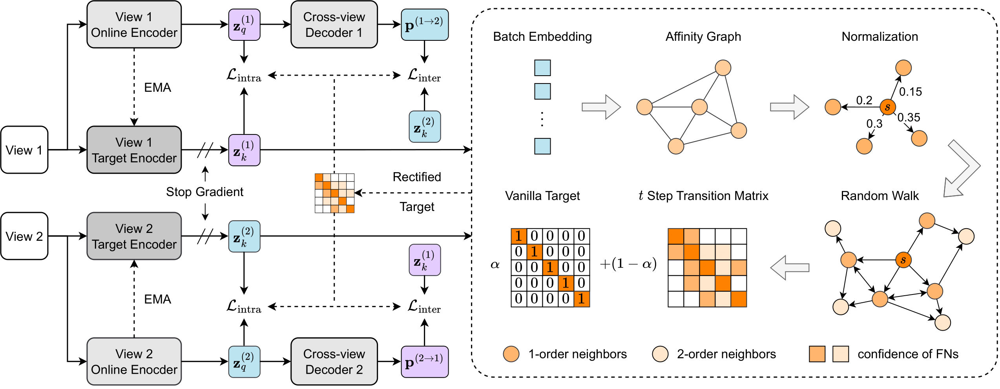

PyTorch implementation for paper [Decoupled Contrastive Multi-View Clustering with High-Order Random Walks](https://arxiv.org/pdf/2308.11164.pdf) (AAAI 2024)




## Requirements

pytorch>=1.13.0 

numpy>=1.23.4

scikit-learn>=0.0.post1

munkres>=1.1.4

## Datasets

You could find the dataset we used in the paper at [Google Drive](https://drive.google.com/drive/folders/1TEDxpnrm3cCJURtP7XmjqJxypArwsiXT?usp=drive_link).


## Training

The hyper-parameters, the training options are defined in the configure file.


~~~bash
main_train.py --config_file=config/Scene15.yaml
~~~

~~~bash
main_train.py --config_file=config/Caltech101.yaml
~~~

## Reference

If you find our work useful in your research, please consider citing:

```latex
@article{lu2023decoupled,
  title={Decoupled Contrastive Multi-view Clustering with High-order Random Walks},
  author={Lu, Yiding and Lin, Yijie and Yang, Mouxing and Peng, Dezhong and Hu, Peng and Peng, Xi},
  journal={arXiv preprint arXiv:2308.11164},
  year={2023}
}
```

